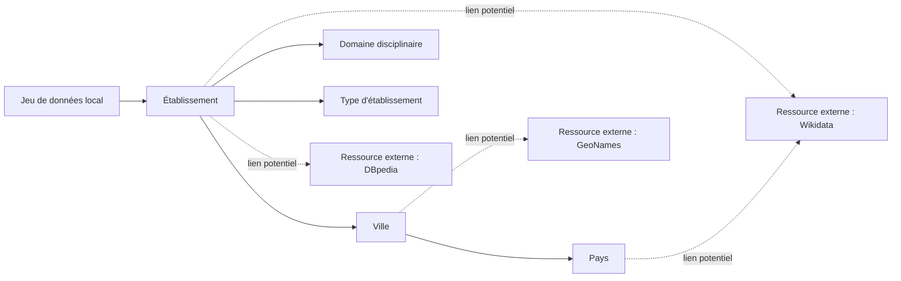

# Carte des entités et des liens potentiels

## 1. Inventaire des entités

| Entité ou type d'entité | Exemple local | Pourquoi s'agit-il d'une entité ? | Attributs associés | Identifiant local potentiel |
| --- | --- | --- | --- | --- |
| Établissement | ENSIAS | Objet réel identifiable avec plusieurs attributs | institution_name, short_name, website, year_created | website |
| Ville | Rabat | Lieu géographique réel distinct de l'établissement | city | aucun (texte libre) |
| Pays | Morocco | Entité géographique de niveau supérieur | country | aucun (texte libre) |
| Type d'établissement | public school | Catégorie qui classifie les établissements | institution_type | aucun (valeur libre) |
| Domaine disciplinaire | computer science | Domaine intellectuel structuré et réutilisable | main_field | aucun (valeur libre) |
| Site web officiel | https://www.ensias.um5.ac.ma | Ressource numérique stable identifiant l'établissement | website | URL |
| Portail Open Data | data.gov.ma | Source institutionnelle productrice des données | portal_hint | URL du portail |
| Année de création | 1992 | Valeur temporelle associée à l'établissement | year_created | valeur numérique |

## 2. Relations conceptuelles observées

| Source | Relation conceptuelle | Cible | Cardinalité | Commentaire |
| --- | --- | --- | --- | --- |
| Établissement | est situé dans | Ville | N → 1 | Plusieurs établissements dans une même ville |
| Établissement | appartient à | Pays | N → 1 | Tous les établissements sont au Maroc |
| Établissement | est de type | Type d'établissement | N → 1 | Ex: university, public school |
| Établissement | a pour domaine | Domaine disciplinaire | N → 1 | Ex: engineering, computer science |
| Établissement | possède | Site web officiel | 1 → 1 | Un site par établissement |
| Établissement | a été créé en | Année de création | 1 → 1 | Une seule année de création |
| Établissement | est publié par | Portail Open Data | N → 1 | Tous viennent de data.gov.ma |
| Ville | est dans | Pays | N → 1 | Rabat, Casablanca → Morocco |
| Pays | contient | Ville | 1 → N | Morocco contient plusieurs villes |
| Type d'établissement | classifie | Établissement | 1 → N | Un type pour plusieurs établissements |

## 3. Liens externes proposés

| Entité locale | Ressource externe candidate | Type de lien envisagé | Critères d'appariement | Justification | Bénéfice attendu | Niveau de confiance | Risque |
| --- | --- | --- | --- | --- | --- | --- | --- |
| Établissement | Wikidata | owl:sameAs | institution_name + city | ENSIAS, UM5, EMI ont des pages Wikidata | Accès à des données enrichies | Élevé | Homonymes possibles |
| Établissement | DBpedia | owl:sameAs | institution_name | Les grandes écoles ont des pages DBpedia | Liens vers Wikipedia | Moyen | Données parfois incomplètes |
| Ville | GeoNames | owl:sameAs | city + country = MA | Rabat, Casablanca sont dans GeoNames | Coordonnées GPS, URI stable | Élevé | Peu de risque |
| Pays | Wikidata | owl:sameAs | country = Morocco | Morocco = Q1028 dans Wikidata | Normalisation géographique | Très élevé | Aucun |
| Domaine disciplinaire | Wikidata | skos:closeMatch | main_field | computer science existe dans Wikidata | Alignement sémantique | Moyen | Traduction ambiguë |

## 4. Schéma conceptuel

## 5. Analyse critique

- **Quels liens vous paraissent les plus fiables ?**
  Le lien Ville → GeoNames est le plus fiable car les villes marocaines 
  comme Rabat, Casablanca, Kenitra existent dans GeoNames avec des 
  identifiants stables et sans ambiguïté.

- **Quels liens restent incertains ?**
  Le lien Établissement → Wikidata reste incertain car certains 
  établissements sont peu connus et peuvent ne pas avoir de page Wikidata.

- **Quelles informations supplémentaires faudrait-il pour automatiser 
  les correspondances ?**
  Il faudrait des coordonnées GPS, des codes officiels des établissements 
  et des identifiants ISCED.

- **Quelles entités devraient recevoir un identifiant stable en priorité ?**
  L'établissement en priorité, car c'est l'entité centrale du dataset.

- **Quels risques de faux positifs ou de collisions d'identifiants 
  avez-vous identifiés ?**
  Le sigle "ENSA" existe pour plusieurs écoles dans différentes villes, 
  ce qui peut créer des confusions.
